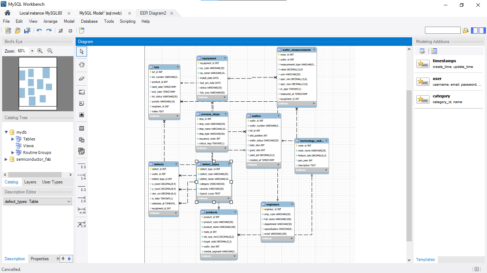
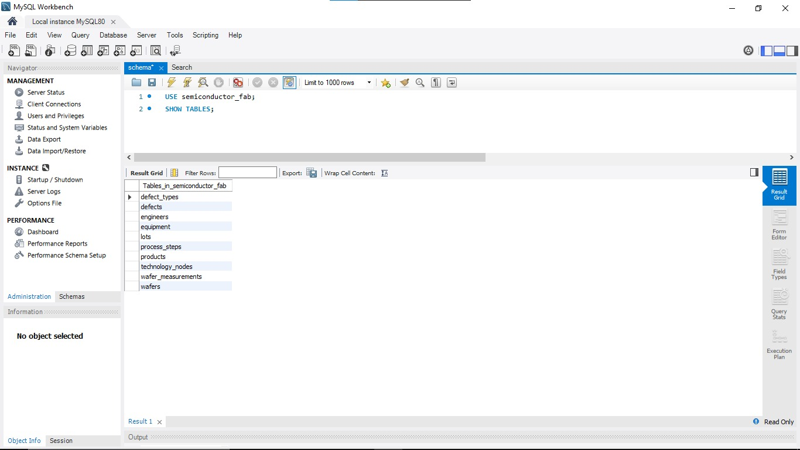
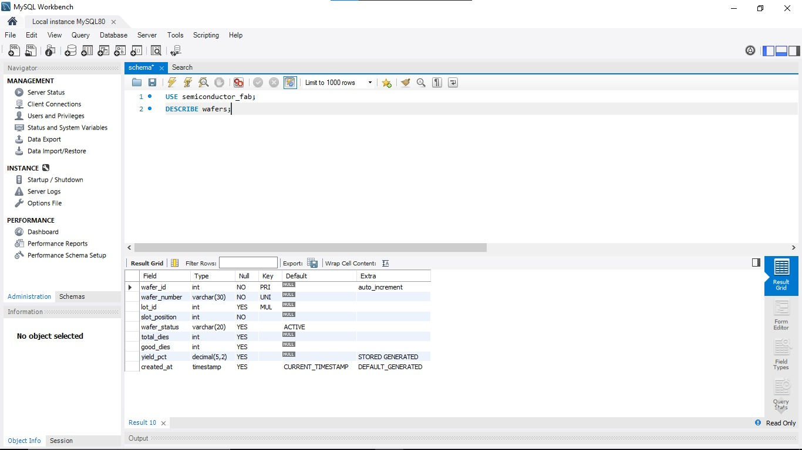
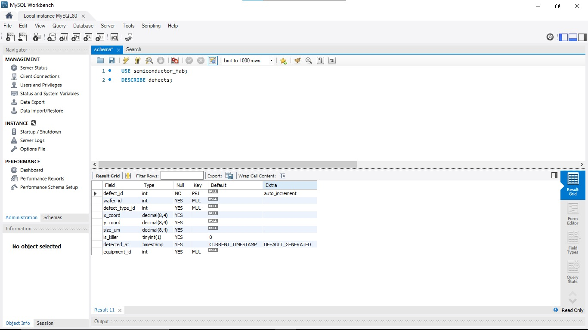
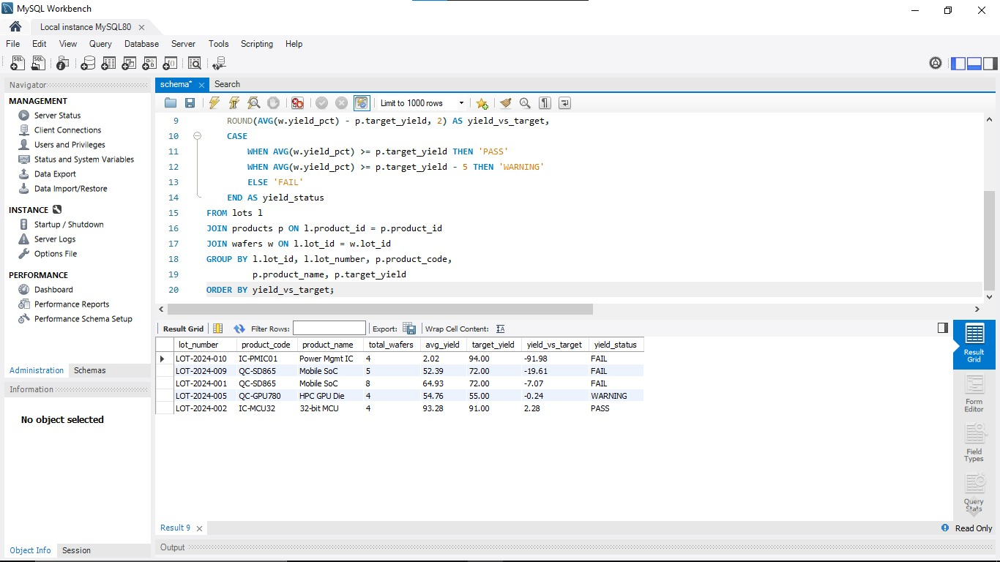
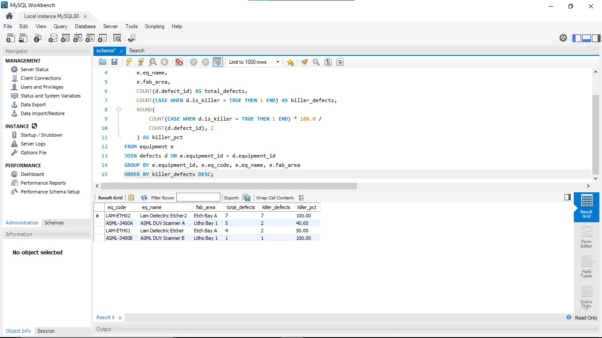
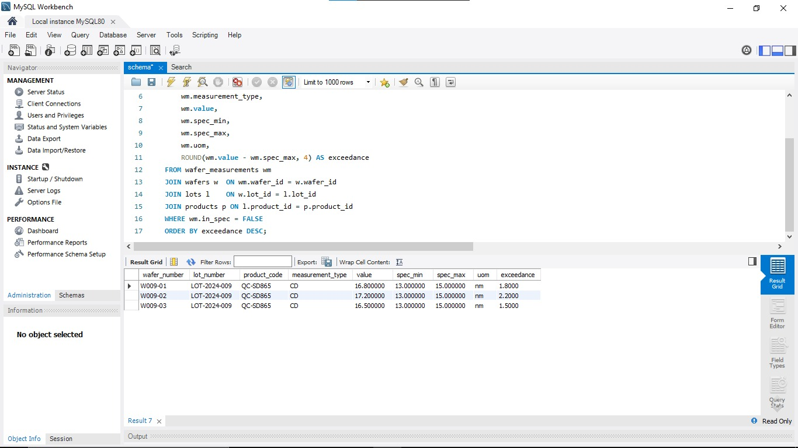
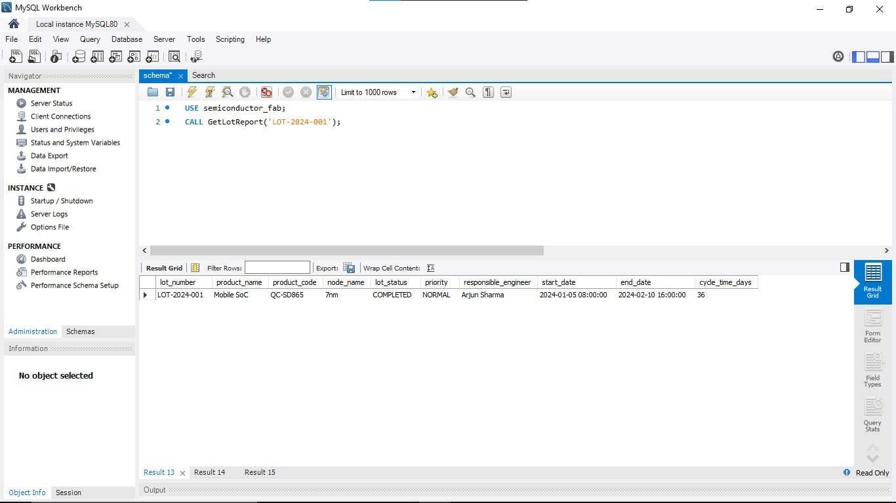

# semiconductor-fab-yield-analysis
"Semiconductor Wafer Fab Yield Analysis System using MySQL"
# 🔬 Semiconductor Fab Yield Analysis System

---

Instead of building a basic SQL beginner project, I wanted to simulate something closer to real-world semiconductor manufacturing systems — where databases track wafer production, yield performance, defects, and equipment health.

This project is my attempt to model that environment using **MySQL + advanced SQL concepts**.

---

## 💡 Why This Project?

Semiconductor companies like **Intel, TSMC, and Qualcomm** rely heavily on data systems to track:

- Wafer yield performance  
- Defect density and classification  
- Equipment reliability  
- Process stability  

This project simulates that workflow at a simplified level using relational database design and analytics.

---

## 🧠 What I Learned

Through this project, I learned:

- Database design and normalization (3NF thinking)
- Complex JOIN operations across multiple tables
- Window Functions (RANK, LAG, PARTITION BY)
- Common Table Expressions (CTEs)
- Stored Procedures for automation
- Real-world interpretation of yield %, defects, and SPC concepts
- How manufacturing data translates into business insights

---

## 🏭 Database Overview

This system simulates a semiconductor fab with 10 interconnected tables:

semiconductor_fab ├── technology_nodes ├── products ├── engineers ├── equipment ├── process_steps ├── defect_types ├── lots ├── wafers ├── defects └── wafer_measurements

---

### 📊 ER Diagram

---

## 📸 Screenshots

### 1. Show Tables

### 2. Wafers Structure

### 3. Defects Structure

### 4. Yield Analysis

### 5. Defect Analysis

### 6. Equipment Health

### 7. Stored Procedure Output

---

## 📊 Key SQL Analytics Implemented

| # | Analysis |
|--|----------|
| 1 | Yield vs Target Performance Analysis |
| 2 | Equipment-wise Defect Contribution |
| 3 | Out-of-Spec Measurement Detection |
| 4 | Wafer Ranking using Window Functions |
| 5 | Engineer Performance Evaluation |
| 6 | Rolling Yield Trend (CTE + LAG) |
| 7 | Defect Pareto Analysis (80/20 rule) |
| 8 | Process Stability (SPC using STDDEV) |
| 9 | Cost of Poor Yield Estimation |
| 10 | Equipment Health Dashboard |

---

## 🕸 Stored Procedure
'''sql
CALL GetLotReport('LOT-2024-001');
CALL YieldExcursionAlert(60.00);
CALL EquipmentDefectReport('LAM-ETH02');

These procedure generate:
   -Lot-level procudition report
   -Yield risk alert
   -Equipment defect summaries

   ---
   
## 🚀 How to Run This Project
   1. Install MySQL 8.0 and MySQL Workbench
   2. Open MySQL Workbench
   3. Import database:
       -Server → Data Import
       -Select Dump20260524.sql
       -Click Start Import
   4. Run:
      USE semiconductor_fab;
   5. Execute queries from the SQL file

---

## 📁 Project Structure
semiconductor-fab-yield-analysis/
├── Dump20260524.sql     → Full database dump
├── README.md            → Project documentation
└── erd_diagram.png      → Database schema diagram

---

## 🙏 Note

This is my first structured SQL project built to go beyond basic exercises and simulate a real semiconductor manufacturing environment.
I'm continuously improving my skills in databases, data engineering, and system design.
Feedback is always welcome.

---

## 📬 Connect With Me

Nallavelli Yuvraj Yadav
🔗 LinkedIn: https://www.linkedin.com/in/nallavelliyuvraj⁠

Built with curiosity, persistence, and real-world engineering inspiration.

